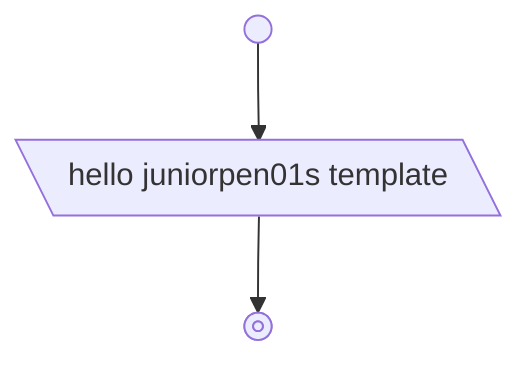

# juniorpen01's Template

juniorpen01's CMake C++ project template.

## Features

This template is cool and awesome because, I, the great juniorpen01, learned
(somewhat) the ins and outs of each technology used in it, and composed it with
my knowledge.

## Flowchart



## Build Instructions

### Prerequisites

> Only tested on these version numbers.

- C++17-compatible compiler (Clang>=14.0.6 is recommended as it is the primary
  compiler used in the project's development)
- Ninja==1.11.1 (optional but recommended)
- CMake==3.25.1
- Git==2.39.5
- Raylib dependencies

### Install Recipes

- Ubuntu/Debian

  ```bash
  sudo apt update && sudo apt upgrade && apt install -y \
  libx11-dev \
  libxrandr-dev \
  libxinerama-dev \
  libxcursor-dev \
  libxi-dev \
  libgl1-mesa-dev \
  ca-certificates \
  clang \
  ninja-build \
  cmake \
  git
  ```

### Building the Project

> Build type can be either release or debug.

1. Configure

   ```bash
   cmake --preset debug
   ```

2. Build

   ```bash
   cmake --build --preset debug
   ```

3. Run

   ```bash
   cd build/debug
   ./juniorpen01s_template
   ```

### Run Tests

```bash
ctest --preset debug
```
